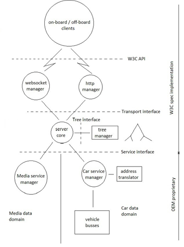

# W3C_VehicleSignalInterfaceImpl
Playground for evaluating the second iteration of the W3C automotive specification.

In order to keep some structure on this playground, the players should try to follow the guidelines below.

Playing shall be done within any of the directories
	1. server
	2. client
	3. pre_dev
These directories each kontain language specific directories for respective playing dialect. If directory for dialect of interest is missing, just create it.

# 3. pre_dev
The real playing should be done under this directory, where new ideas, etc can be evaluated. Please create a directory for the play, and create a README.md file from the template.

# 1. server
Playing under the server directory should align with the project common software architecture. Significant deviations should be documented in the README.md file.

# 2. client
The playing under the client directory has as a prime target testing of the server implementations. To play, create a directory if a new testscope is addressed. In the README.md file, please describe the testscope, build and test intructions.

# Project common software architecture
The server functionlity has a complexity level that warrants some thoughts on how a good software architecture could look like. 
The figure below is the current proposal on this. Improvements are welcome, which typically starts with some playing in pre_dev, and a discussion on the issue list, before a pull request may be issued.
 
*Fig 1. Software architecture overview
