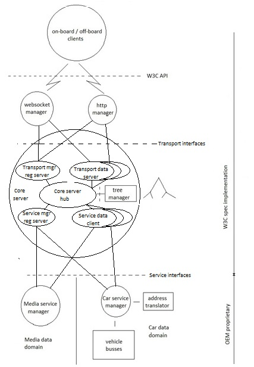

# Project: W3C_VehicleSignalInterfaceImpl: server/server-1.0

Functionality:  
	Long term: Server implementation following the project SwA, with capability to serve multiple app-clients over both WebSockets and HTTP protocols in parallel. 
	Short term limitations:  
                - The transport protocols are not the secure versions of Websockets and HTTP.  
		- Max two parallel app-clients for each of HTTP and Websoclket protocols.  
		- Access restriction not implemented.  
		- Responses for error cases may not be correct (or even have JSON format). 
		- Only one service manager can register with the core server. 
		- The service manager returns dummy values for get. 
		- The service manager does not update values for set. 
		- The service manager returns dummy values every five secs for subscription. 

Implementation language: Go for server, JS for app-clients (clients also found in clients/clients-1.0 directory).

## Build instructions:
Run the following go programs in separate terminal windows, then start the app client in a browser.

Server core: 
$ go build 
$ ./server-core 
Service manager mgr: 
$ go run service_mgr.go 
Websocket protocol mgr: 
$ go run ws_mgr.go 
HTTP protocol mgr: 
$ go run http_mgr.go 
Start websocket app-client: 
Click on wsclient.html (and/or wsclient2.html) 
Start HTTP app-client: 
Click on httpclient.html (and/or httpclient2.html) 
The order of starting the different programs should be:
1. servercore.go
2. service_mgr.go
3. ws_mgr.go and/or http_mgr.go
4. wsclient.html and/or httpclient.html

After the startup sequence above, write any VISS request with correct JSON syntax in the app client input field, e. g.:
{"action":"get", "path":"Vehicle.Cabin.Door.*.*.IsOpen", "requestId":123}
and after pushing Send a response starting with "Server:" followed by the JSON formatted response, will be shown in the client browser tab. 
If the path in the request have several matches in the tree, the response will be concatenated by the number of matches (the example above 8 times).
It is possible to start a second app-client and send request from one or the other client (see restrictions at the top). 

To terminate a client close the browser tab.

Terminate core server, websocket/HTTP transport managers, and service manager by Ctrl-C in respective terminal window.

The appclient_commands.txt file contains a few examples of requests that can be copied into the send fields of the clients. Feel free to modify the request before sending.

## Software implementation
Figures 1 and 2 shows the design of the core server and the Websocket transport manager, respectively. The design is based on the high level Sw Architecture description found in the README of the root directory. 
The drawings to the left in the two figures show a high level view where cases of possible multiple instances of components are shown, while the drawings to the right show a more detailed view, but where for simplicity only a single instance of components are shown. 
The core server is partitioned in the following logical components: 
- Core server hub - the manager, tying it all together, 
- The transport manager registration server, managing the registration of transport protocol managers over HTTP, 
- Transport data channel server, exist in multiple instances, one for each registered transport manager, managing the data communiction, 
- The service manager registration server, managing the registration of service managers over HTTP, 
- Service data channel client, exist in multiple instances, one for each registered service manager, managing the data communiction, 
- The tree manager, providing access to the tree, abstracting the actual format of the tree, and more complex operations such as tree search, tree initiation and termination. 
The core server hub, running in the main context, spawns the following Go routines: 
- The transport manager registration server. 
- Transport data channel servers, each having separate frontend and a backend go routine. 
- The service manager registration server. 
- Service data channel servers, each having separate frontend and a backend go routines. 
The Go routines communicate in between using Go channels. 
The communication with the transport protocol and service managers is realized using the Websocket protocol. 
 
* Fig. 1 Core server design 
The Websocket transport protocol manager is partitioned in the following logical components: 
- Websocket manager hub, the manager, responsible for registration with the core server, spawning of Websocket servers for connecting app-clients, and routing of messages to/from app-clients, etc., 
- Websocket server,  exist in multiple instances, one for each app-client that connects to it. 
 
* Fig. 2 Websocket transport manager design 
The Websocket hub and WS servers run in separate Go routines, each having separate frontend and a backend go routine, and communicate with each other via Go channels. 
The data communication with the core server uses the Websocket protocol, as well as its communication with the app-clients. 
The HTTP manager has the same architecture as the WS manager. It converts the request data from the HTTP call into the Websocket format before sending it to the core server, and it converts the Websocket response from the core server into the HTTP response before sending it back to the app-client. 
The HTTP manager supports the same functional set of requests as the Websocket manager, except for subscription. 
The pattern for the access restriction use case is slightly different, as the token is to be included in the get/set request, and not sent as a separate request as in the WS pattern. However, currently the support for access restriction is not implemented.
