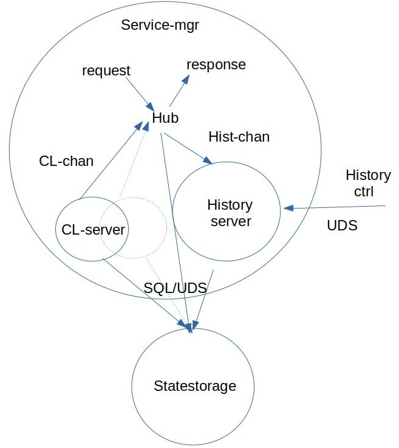

**(C) 2020 Geotab Inc** 

All files and artifacts in this repository are licensed under the provisions of the license provided by the LICENSE file in this repository.

# VISS v2 service manager

The service manager may at startup be supplemented with one or two flags: -uds and/or -vssPathList 
The uds flag sets the path and filename for the Unix domain socket communication used for history control, see below. This flag has a default value of "/var/tmp/vissv2/histctrlserver.sock". 
The vssPathList flag sets the path to a file containing a JSON list of all leaf nodes in the VSS tree being used. This flag has a default value of "../vsspathlist.json". 
The flags can be set to any value by following the flag with the new value in the startup command.
If one or both of the flags are left out in the command, requests for historic data always return an error message saying there is no historic data available. 

If a request contains an array of paths, then the response/notification will include values related to all elements of the array. 

The service manager will do its best to interpret subscription filter expressions, but if unsuccessful it will return an error response without activating a subscription session.

The figure shows the internal architecture of the service manager when it comes to handling of request for historic data and use of curve logging.
 

Each request for a curve logging subscription instantiates a Go routine that handles the request. An unsubscribe request kills the Go routine. 

## Historic data
A Go routine for handling of historic data is spawned at server start up. The vehicle system can via the History control interface control the saving of data for one o more signals via a Unix Domain Socket command with the socket address /var/tmp/vissv2/histctrlserver.sock. 
The write commands available are: 
1. {"action":"create", "path": X, "buf-size":"Y"} 
2. {"action":"start", "path": X, "freq":"Z"} 
3. {"action":"stop", "path": X} 
4. {"action":"delete", "path": X} 
where X can be a single path "x.y.z", or an array of paths ["a.b.c", ..., "x.y.z"], Y is the max number of samples that can be buffered, which must be less than 65535, and Z is the capture frequency in captures per hour, which must be less than 65535. 

The create request leads to the creation of a buffer of the size requested. 
The start request initates capture of samples at the set frequency until the buffer is full. 
The stop request halts the capture of samples. 
the delete request discards the buffer. 

If a client issues a request for historic data, specifying a period from now and backwards in time, then the service manager will check if there is historic data saved, and select the part that matches the requested period. If there is no data saved, then the response will only contain the latest data point. 

This architecture supports a use case where a high frequency capture rate is applied to the battery voltage during cranking of the starter motor. The vehile can then start the saving of this data at a high capture frequency, and then issue a stop command when the motor has started. This data can then be available for some time so that a client has a resonable time to issue a request for it. 

Another use case could be that the vehicle temporarily loses its connection, maybe due to passage through a tunnel. If this is detected by the vehicle telematics unit, it may issue a request over the History control interface to start saving multiple selected signals, but with buf-size set to zero. The later means that the buffer size is automatically increased when it becomes full. 
The saving of data will automatically stop at some max limit if no stop command is issued before that.

A third use case could be that data related to electrical charging shall be saved, the vehicle system then uses the start and stop commands to record the appropriate signals during the charging session.

## State storage
The VISSv2 service manager is started with input on which state storage implementation to use:
- SQLite (default)
- Redis
- None

At startup, 
- for SQLite it tries to read a DB file named statestorage.db, located in the same directory.
- for Redis it tries to instantiate a Redis client for the configured Redis DB. 
- For None, the server will instead of accessing data from a DB, instead generate a dummy integer value, see below.

Dummy values are always an integer, taken from a counter that is incremented every 37 msec, and wrapping to stay within the values 0 to 999.

Data is captured from the statestorage, and it is only saved in the buffer if the timestamp differs from the previously latest saved. This polling paradigm may be replaced by an event driven paradigm if/when the statestorage supports it. With this polling paradigm, the capture frequency to be set must be higher than the actual update frequency of the signal in the statestorage. Other system latencies should also be taken into account when selecting this frequency as the frequency sets the sleep time in the capture loop.

If the state storage is started using the Redis DB, the following must be prepared before starting the server. 
- The directory /var/tmp/vissv2 must exist.
- The Redis DB must be initiated by building,  and running the redisInit executable as root. 
In the redisInit directory: 
$ go build 
$ sudo ./redisInit 
- The VISSv2 server startup shell script must have "redis" as a second parameter: 
$ ./W3CServer.sh startup redis 
If the MQTT transport protocol is to be used, the Redis database must be preprovisioned with a VIN, which is done by building and running the VIN feeder executable: 
In the redisVinFeeder directory: 
$ go build 
$ ./redisVinFeeder VIN 
where VIN is any string representing the desired VIN. 

If the state storage is started using the SQLite DB, the following must be prepared before starting the server. 
- The SQLite DB file must be created and stored in the directory of the service manager. Creating it can be done using the Statestorage manager found at https://github.com/COVESA/ccs-components/tree/master/statestorage/sqlImpl. It must be generated with an identical copy of the vsspathlist.json file that the VISSv2 server creates at startup (from the vss_vissv2.binary file).

## Curve logging
Geotab has opened up the curve logging patents for public use, see <a href="https://github.com/Geotab/curve">Curve logging library</a>.
This curve logging implementation can be applied to one through three dimensional signals, where signal dimensionality is defined in the file signaldimensions.json. This file is prepopulated with the following content:
{"dim2":[{"path1":"Vehicle.Cabin.Infotainment.Navigation.CurrentLocation.Latitude", "path2":"Vehicle.Cabin.Infotainment.Navigation.CurrentLocation.Longitude"}], 
 "dim3":[{"path1":"Vehicle.Acceleration.Lateral", "path2":"Vehicle.Acceleration.Longitudinal", "path3":"Vehicle.Acceleration.Vertical"}]}
 
If a curve logging request contains multiple signals, and they match a set that is defined in this file, then the curve logging implementation treats them as two- or three-dimensional signals, else they are treated as one-dimensional. If two signals of a 3-dimensional definition are found, they are treated as 2-dimensional. 
For an N dimensional signal, the curve logging algorithm processes the signals in an N+1 dimensional space (time is the additional dimension). The max acceptable error is then the distance between the sample point and the linear curve in the N dimensional space, for the same time value ("vertical distance"). 

